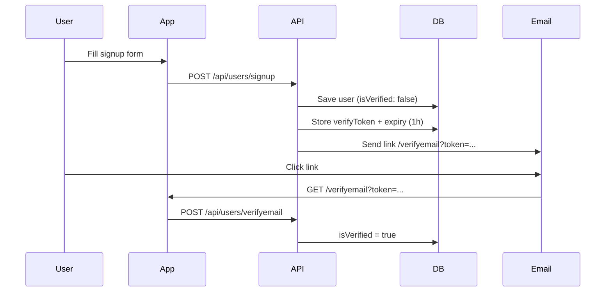

# Auth Next.js — Full-Stack Authentication & Profile Manager

A production-style authentication application built with **Next.js 16** (App Router), **MongoDB**, **JWT** (HTTP-only cookies), **bcrypt**, and **Nodemailer**. It includes signup, login, email verification, password reset, protected routes, and a user profile dashboard with a modern dark UI.

---

## Table of Contents

- [Features](#features)
- [Tech Stack](#tech-stack)
- [Project Structure](#project-structure)
- [Prerequisites](#prerequisites)
- [Environment Variables](#environment-variables)
- [Installation](#installation)
- [Running the App](#running-the-app)
- [Pages & Routes](#pages--routes)
- [API Reference](#api-reference)
- [Authentication Flows](#authentication-flows)
- [Route Protection (Proxy)](#route-protection-proxy)
- [User Model](#user-model)
- [Email Setup (Mailtrap)](#email-setup-mailtrap)
- [UI / UX](#ui--ux)
- [Troubleshooting](#troubleshooting)
- [Scripts](#scripts)
- [Deployment Notes](#deployment-notes)
- [License](#license)

---

## Features

| Feature | Description |
|--------|-------------|
| **User signup** | Register with username, email, and password (hashed with bcrypt) |
| **Email verification** | Verification link sent on signup; token expires after 1 hour |
| **Login / logout** | JWT stored in an HTTP-only cookie; session lasts 1 day |
| **Forgot password** | Reset link emailed to user (email or username lookup) |
| **Reset password** | Set a new password via token from email |
| **Protected profile** | Dashboard loads current user via `/api/users/me` |
| **Public profile** | View any user at `/profile/[id]` |
| **Route guard** | `src/proxy.ts` redirects unauthenticated users away from protected pages |
| **Responsive UI** | Zinc/emerald theme, cover images, avatars, loading & error states |

---

## Tech Stack

| Layer | Technology |
|-------|------------|
| Framework | [Next.js 16](https://nextjs.org) (App Router) |
| Language | TypeScript + JavaScript (Mongoose model) |
| Database | [MongoDB](https://www.mongodb.com) via [Mongoose](https://mongoosejs.com) |
| Auth | [jsonwebtoken](https://github.com/auth0/node-jsonwebtoken) + HTTP-only cookies |
| Password hashing | [bcryptjs](https://github.com/dcodeIO/bcrypt.js) |
| Email | [Nodemailer](https://nodemailer.com) (Mailtrap sandbox) |
| HTTP client | [Axios](https://axios-http.com) |
| Styling | [Tailwind CSS v4](https://tailwindcss.com) |
| Notifications | [react-hot-toast](https://react-hot-toast.com) |

---

## Project Structure

```
auth-nextjs/
├── public/                    # Static assets
├── src/
│   ├── app/
│   │   ├── api/users/         # REST API routes
│   │   │   ├── signup/
│   │   │   ├── login/
│   │   │   ├── logout/
│   │   │   ├── me/
│   │   │   ├── verifyemail/
│   │   │   ├── forgotPassword/
│   │   │   ├── resetPassword/
│   │   │   └── [id]/          # Get user by ID
│   │   ├── page.tsx           # Home / landing page
│   │   ├── login/
│   │   ├── signup/
│   │   ├── verifyemail/
│   │   ├── forgotPassword/
│   │   ├── resetPassword/
│   │   └── profile/
│   │       ├── page.tsx       # Logged-in dashboard
│   │       └── [id]/          # Public profile view
│   ├── dbConfig/
│   │   └── dbConfig.ts        # MongoDB connection (singleton)
│   ├── helper/
│   │   ├── mailer.ts          # Send verify / reset emails
│   │   └── getDataFromtToken.ts
│   ├── lib/
│   │   └── profile.ts         # Avatar URL helper, shared types
│   ├── Models/
│   │   └── userModel.js       # Mongoose user schema
│   └── proxy.ts               # Route protection (Next.js proxy)
├── next.config.ts             # Image domains for avatars / Unsplash
├── package.json
└── README.md
```

---

## Prerequisites

Before you begin, make sure you have:

1. **Node.js** 18+ installed  
2. A **MongoDB** database (local MongoDB or [MongoDB Atlas](https://www.mongodb.com/atlas))  
3. A **[Mailtrap](https://mailtrap.io)** account (or another SMTP provider) for development emails  
4. A strong **JWT secret** (`TOKEN_SECRET`)

---

## Environment Variables

Create a `.env` or `.env.local` file in the project root:

```env
# MongoDB connection string
MONGO_URL=mongodb://127.0.0.1:27017/auth-nextjs

# JWT signing secret (use a long random string in production)
TOKEN_SECRET=your_super_secret_jwt_key_here

# Base URL of your app (no trailing slash) — used in email links
domain=http://localhost:3000

# Mailtrap SMTP credentials (sandbox)
EMAIL_USER=your_mailtrap_username
EMAIL_PASS=your_mailtrap_password
```

| Variable | Required | Description |
|----------|----------|-------------|
| `MONGO_URL` | Yes | MongoDB connection URI |
| `TOKEN_SECRET` | Yes | Secret for signing and verifying JWTs |
| `domain` | Yes | App base URL for links in emails (`/verifyemail?token=...`, `/resetPassword?token=...`) |
| `EMAIL_USER` | Yes | SMTP username (Mailtrap) |
| `EMAIL_PASS` | Yes | SMTP password (Mailtrap) |

> **Important:** Email links are built as `${domain}/verifyemail?token=...`. If `domain` is wrong, verification and password reset links will not work.

---

## Installation

```bash
# Clone the repository
git clone <your-repo-url>
cd auth-nextjs

# Install dependencies
npm install
```

---

## Running the App

### Development

```bash
npm run dev
```

Open [http://localhost:3000](http://localhost:3000) in your browser.

### Production build

```bash
npm run build
npm start
```

### Lint

```bash
npm run lint
```

---

## Pages & Routes

| Route | Access | Description |
|-------|--------|-------------|
| `/` | Public | Landing page; shows different content if logged in |
| `/signup` | Public | Create a new account |
| `/login` | Public | Sign in with email/username + password |
| `/verifyemail?token=...` | Public | Verifies email (token from signup email) |
| `/forgotPassword` | Public | Request a password reset link |
| `/resetPassword?token=...` | Public | Set a new password (token from reset email) |
| `/profile` | Protected | Current user's dashboard |
| `/profile/[id]` | Protected | Public profile view for a user ID |

---

## API Reference

All API routes live under `/api/users/`.

### `POST /api/users/signup`

Create a new user and send a verification email.

**Body:**

```json
{
  "username": "johndoe",
  "email": "john@example.com",
  "password": "yourpassword"
}
```

**Success:** `200` — user created; verification email sent.

---

### `POST /api/users/login`

Authenticate and set an HTTP-only `token` cookie.

**Body:**

```json
{
  "email": "john@example.com",
  "password": "yourpassword"
}
```

> `email` field accepts **email or username** (case-insensitive email).

**Success:** `200` — `{ "message": "Login successful" }` + `token` cookie.

---

### `GET /api/users/logout`

Clears the `token` cookie.

**Success:** `200` — `{ "message": "Logged out successful", "success": true }`

---

### `GET /api/users/me`

Returns the currently logged-in user (requires `token` cookie).

**Success:** `200` — `{ "message": "user found", "data": { ...user } }` (password excluded)

---

### `GET /api/users/[id]`

Returns a user by MongoDB `_id` (password excluded).

**Success:** `200` — `{ "message": "User found", "data": { ...user } }`  
**Error:** `404` — user not found

---

### `POST /api/users/verifyemail`

Verify a user's email using the token from the signup email.

**Body:**

```json
{
  "token": "$2b$10$..."
}
```

**Success:** `200` — sets `isVerified: true` and clears verify token fields.

---

### `POST /api/users/forgotPassword`

Send a password reset email.

**Body:**

```json
{
  "email": "john@example.com"
}
```

> Accepts **email or username**.

**Success:** `200` — reset link sent (if user exists).

---

### `POST /api/users/resetPassword`

Reset password using the token from the reset email.

**Body:**

```json
{
  "token": "$2b$10$...",
  "password": "newpassword"
}
```

**Success:** `200` — password updated; reset token cleared.

---

## Authentication Flows

### 1. Signup & email verification



1. User signs up on `/signup`.  
2. Server hashes the password and saves the user.  
3. `sendEmail` in `src/helper/mailer.ts` generates a bcrypt token, saves it on the user, and emails a link.  
4. User clicks the link → `/verifyemail?token=...`.  
5. The page reads the token with `useSearchParams()` (not shown in the UI) and calls the verify API.

### 2. Login & session

1. User submits credentials on `/login`.  
2. API compares password with `bcrypt.compare`.  
3. On success, a JWT is signed and stored in an **HTTP-only** cookie named `token` (expires in 1 day).  
4. Protected pages and `/api/users/me` read this cookie via `getDataFromToken`.

### 3. Forgot & reset password

1. User requests reset on `/forgotPassword`.  
2. API finds user by email/username and sends email with link `/resetPassword?token=...`.  
3. Token is stored in `forgotPasswordToken` with 1-hour expiry.  
4. User opens the link, enters a new password, and submits to `POST /api/users/resetPassword`.  
5. Password is hashed and saved; token fields are cleared.

> Tokens in URLs use `encodeURIComponent()` so bcrypt characters like `$` are not broken. The browser decodes them automatically for `useSearchParams().get("token")`.

---

## Route Protection (Proxy)

`src/proxy.ts` runs on matched routes and:

- **Redirects to `/login`** if the user has no `token` cookie and visits a protected path.  
- **Redirects to `/profile`** if the user is already logged in and visits `/login` or `/signup`.  
- **Allows public access** to `/`, `/login`, `/signup`, `/verifyemail`, `/forgotPassword`, `/resetPassword`.

**Protected by default:** `/profile` and `/profile/*`

---

## User Model

Defined in `src/Models/userModel.js`:

| Field | Type | Description |
|-------|------|-------------|
| `username` | String | Unique |
| `email` | String | Unique, stored lowercase on signup |
| `password` | String | bcrypt hash |
| `isVerified` | Boolean | Default `false` |
| `isAdmin` | Boolean | Default `false` |
| `verifyToken` | String | Email verification token |
| `verifyTokenExpiry` | Date | Verification link expiry |
| `forgotPasswordToken` | String | Password reset token |
| `forgotPasswodExpiry` | Date | Reset link expiry (note: typo in field name) |

---

## Email Setup (Mailtrap)

This project uses **Mailtrap** for development (emails are not delivered to real inboxes).

1. Create a free account at [mailtrap.io](https://mailtrap.io).  
2. Open **Email Testing → Inboxes → SMTP Settings**.  
3. Copy **Username** and **Password** into `EMAIL_USER` and `EMAIL_PASS`.  
4. Set `domain=http://localhost:3000` (or your deployed URL).  
5. After signup or forgot-password, open the Mailtrap inbox and click the **“here”** link in the email.

**Email link format:**

```
{domain}/verifyemail?token={encodedToken}
{domain}/resetPassword?token={encodedToken}
```

---

## UI / UX

The app uses a consistent **dark zinc + emerald** design across all auth pages:

- Split layout with cover image (Unsplash) on desktop  
- Form states: disabled buttons, loading text, validation messages  
- Profile avatars via [ui-avatars.com](https://ui-avatars.com)  
- Toast notifications for success and errors  
- Home page (`/`) adapts for guests vs logged-in users  

**Image domains** are configured in `next.config.ts` for `ui-avatars.com` and `images.unsplash.com`.

---

## Troubleshooting

### “Invalid or expired token” on reset / verify

- Use the **latest** email link (each new request generates a new token).  
- Links expire after **1 hour**.  
- Ensure `domain` in `.env` matches the URL you open in the browser.  
- Open the link from Mailtrap, not `/verifyemail` or `/resetPassword` without `?token=...`.

### Cannot log in after reset

- Use the **same email** you signed up with (or your username).  
- Restart the dev server after changing `.env`.  
- Request a **new** reset email if the old link was already used.

### Emails not sending

- Check `EMAIL_USER` and `EMAIL_PASS`.  
- Confirm Mailtrap inbox is active.  
- Check the terminal for API errors on signup / forgot-password.

### Redirected to login on `/profile`

- You are not logged in or the cookie expired.  
- Sign in again; ensure `TOKEN_SECRET` has not changed (that invalidates existing tokens).

### MongoDB connection errors

- Verify `MONGO_URL` and that MongoDB is running (or Atlas IP whitelist is configured).

---

## Scripts

| Command | Description |
|---------|-------------|
| `npm run dev` | Start development server |
| `npm run build` | Create production build |
| `npm start` | Run production server |
| `npm run lint` | Run ESLint |

---

## Deployment Notes

1. Set all [environment variables](#environment-variables) on your host (Vercel, Railway, etc.).  
2. Use your **production URL** for `domain` (e.g. `https://your-app.vercel.app`).  
3. Switch Nodemailer from Mailtrap to a real provider (SendGrid, Resend, AWS SES, etc.) in `src/helper/mailer.ts`.  
4. Use a strong, unique `TOKEN_SECRET`.  
5. Enable HTTPS so secure cookies work correctly in production.  
6. Add your production image domains to `next.config.ts` if needed.

---

## License

This project is open source and available for learning and portfolio use. Add your preferred license file if you publish the repository publicly.

---

## Author

Built as a **Full-Stack Profile Manager** with Next.js authentication — signup, verify, login, profile, and password recovery in one app.
